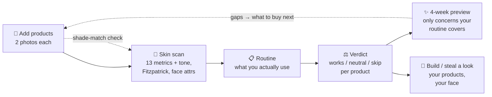
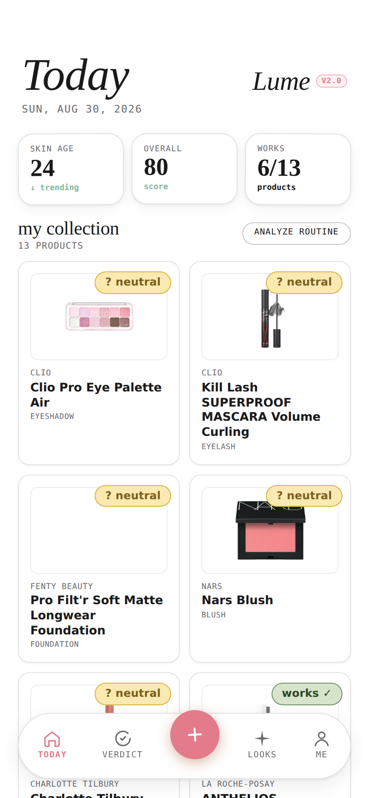
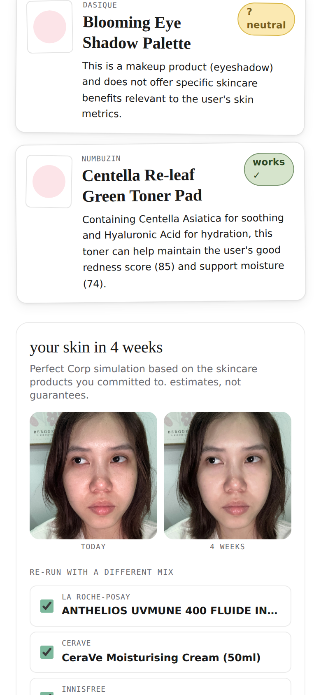
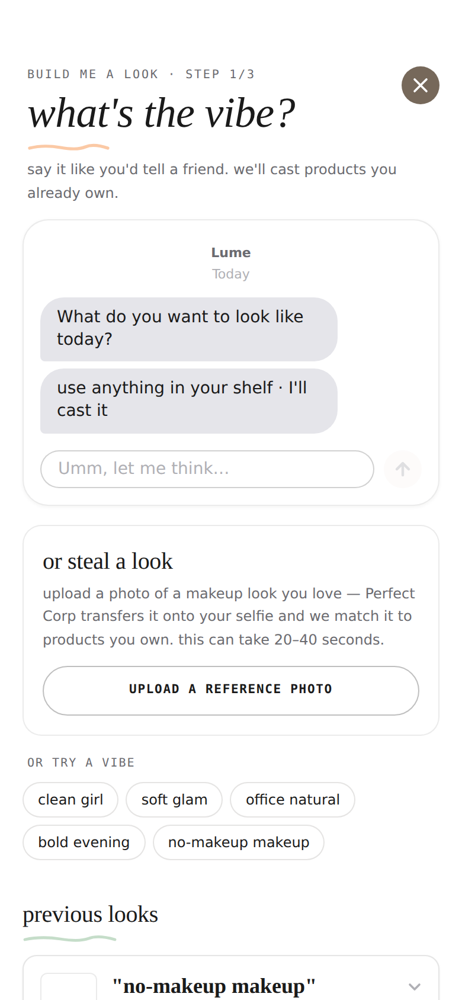
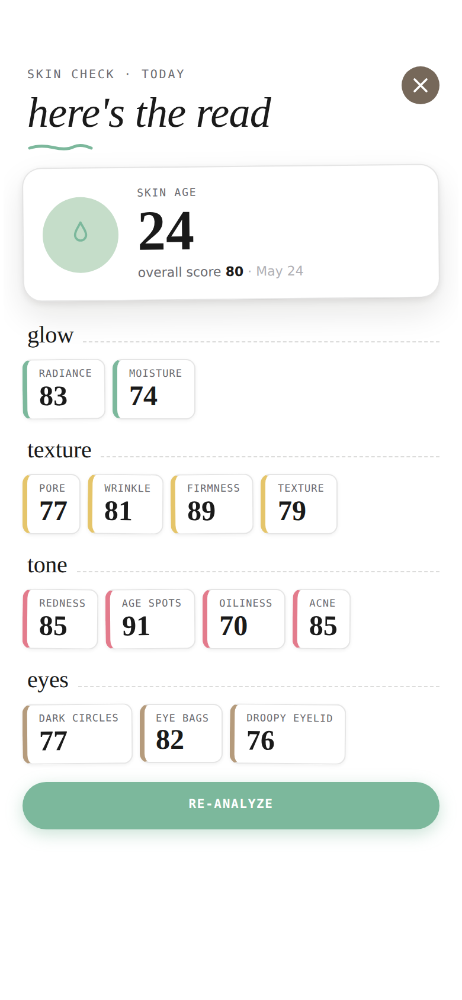
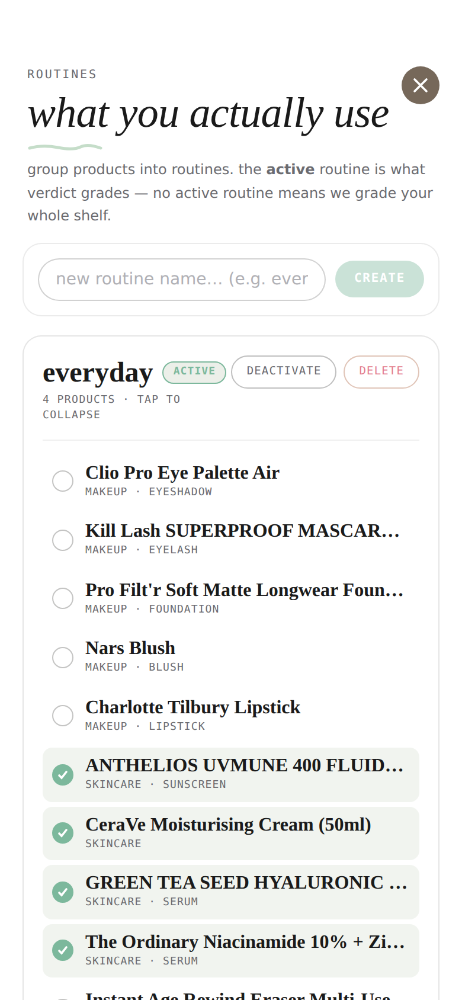
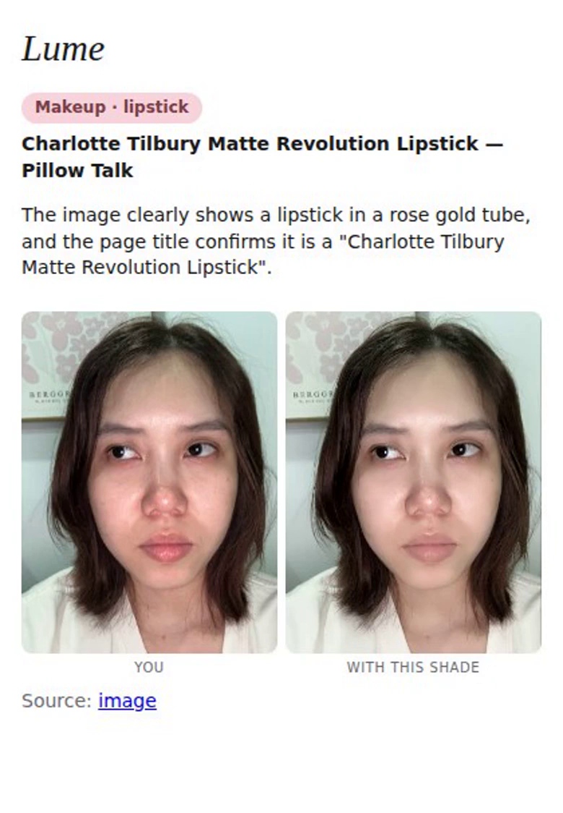
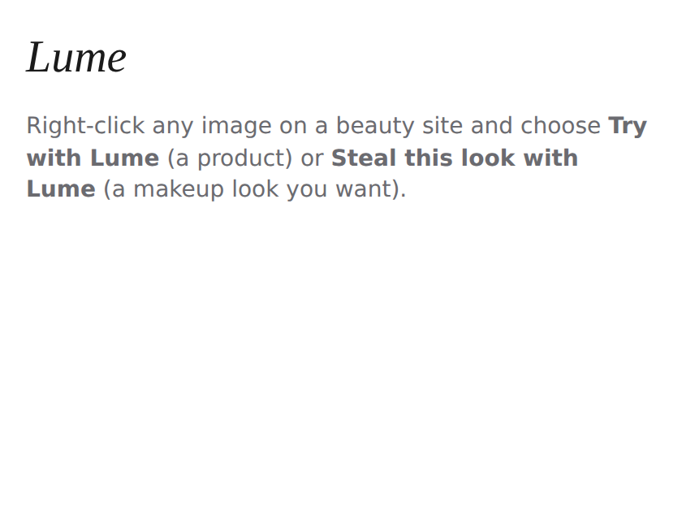
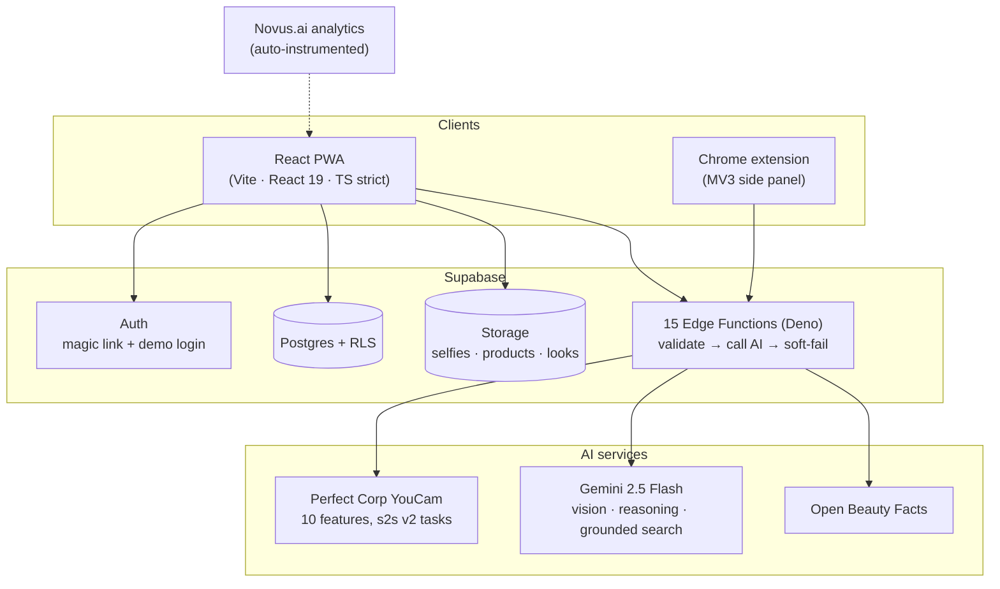
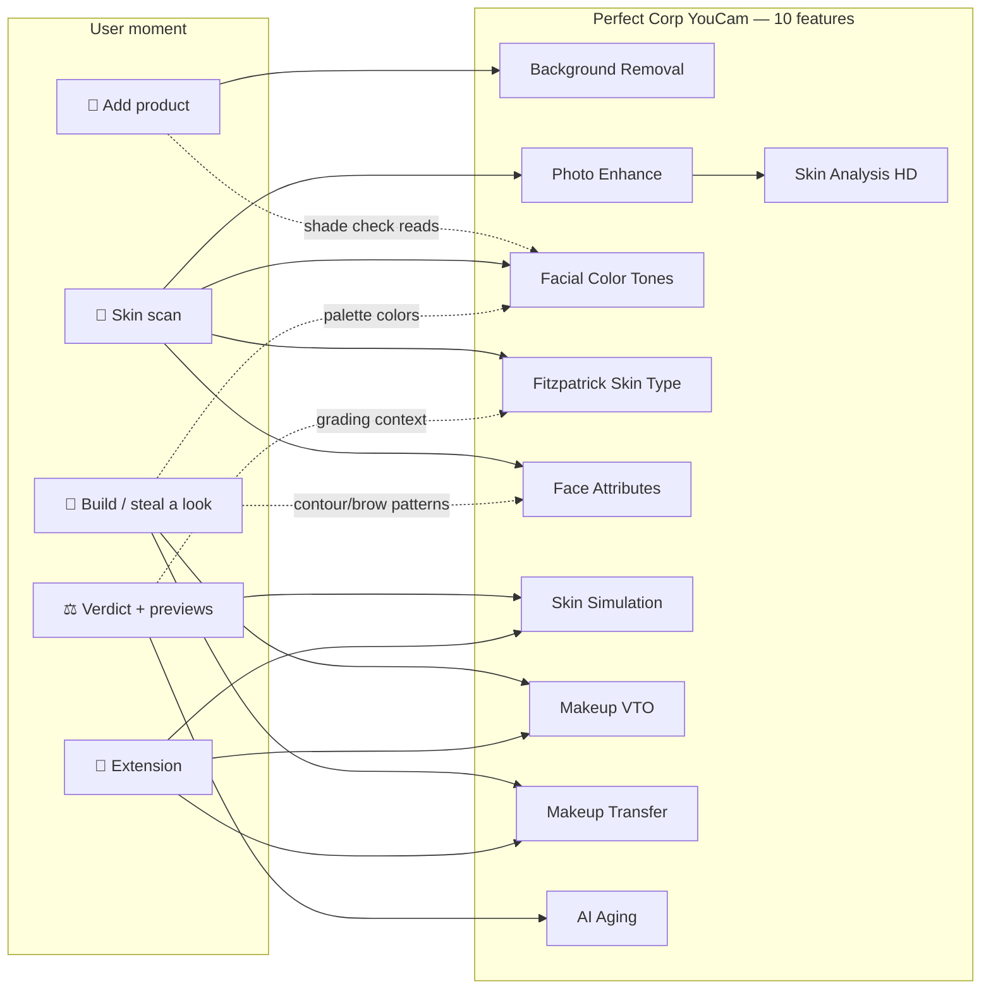

# Lume

A beauty and skincare collection app: log makeup and skincare products with two photos each, get AI-powered analysis of which products actually work for *your* skin, and generate makeup looks using only what you own.

Built for **Mind the Product — World Product Day: Everyone Ships Now** (Devpost), shipping with [Novus.ai](https://www.novus.ai/) product analytics auto-instrumented from the repo.

## How it flows



## Screenshots

<!-- Drop PNGs into docs/images/ with these exact names (see docs/images/shot-list.md) and they render here. -->

| Dashboard | Verdict + coverage | Steal a look |
| --- | --- | --- |
|  |  |  |

| Skin scan | Routines | Extension: live try-on |
| --- | --- | --- |
|  |  |  |

<p align="center">
  <br/>
  <em>Extension: personalized 4-week skincare preview + clash check</em>
</p>

## What it does

- **Add a product in two photos.** Snap the front; Lume removes the background, reads name, brand, subcategory, and shade in parallel. Snap the back; it OCRs the ingredients list. If the box was tossed and OCR comes up empty, Lume searches Open Beauty Facts and falls back to a Gemini grounded web search so you never hand-type 30 ingredients. Adding a foundation or concealer? Lume checks the shade against your analyzed skin tone and warns if it runs warm/cool/light/deep for you.
- **One selfie, a full face profile.** Perfect Corp's Skin Analysis returns 13 metrics (wrinkle, pore, acne, redness, moisture, dark circle, firmness, radiance, …). The same selfie silently yields your skin tone palette, Fitzpatrick skin type (I–VI), and five face attributes (face shape, eye shape, eyelid, brow shape, lip shape). Blurry photo? AI Photo Enhance cleans it up before analysis.
- **Routines.** Group the products you *actually use* into named routines. The active routine is what verdict grades — no more judging the serum that's been in a drawer for two years.
- **Per-product verdict.** Gemini cross-references your skin metrics against each product's ingredients — aware of your Fitzpatrick type (photosensitivity, SPF weight) — and tags every product **works**, **neutral**, or **skip** with one sentence of reasoning anchored to a specific metric.
- **Honest skin previews.** "Preview your skin in 4 weeks" simulates only the concerns your works-pile actually targets (Perfect Corp Skin Simulation) and tells you which low-scoring concerns your routine does *not* cover yet. A separate "fast forward" card runs AI Aging — labeled clearly as a generic simulation.
- **Build or steal a look.** Describe a vibe ("soft glam date night") and Gemini casts your own makeup — real product colors inferred from shade names, contour/brow patterns matched to your analyzed face shape and brow shape, foundation matched to your skin tone — rendered by Perfect Corp Makeup VTO. Or upload any makeup photo and **Makeup Transfer** puts that look on your face, mapped to the products you own plus a list of gaps to shop.
- **Chrome extension: try before you buy, anywhere.** Right-click any product image on the web. Makeup → live virtual try-on: **you | with this shade**, your selfie next to the Perfect Corp Makeup VTO render. Skincare → a **4-week preview personalized to your latest scan** (Skin Simulation intensity scaled to your actual metric scores), with chips for what it helps and an honest "you don't need this" — Lume skips the render entirely when the product targets nothing on your radar. Every skincare product is also **clash-checked against your active routine** (retinoid × AHA and friends, severity-ranked). **Steal this look with Lume** transfers the photographed makeup onto you. Load-unpacked; see `extension/README.md`.

## Architecture



## Perfect Corp API coverage

Ten YouCam features, composed — the analyses feed the try-ons: skin tone
drives VTO colors and shade checks, face attributes pick VTO patterns,
Fitzpatrick shapes the verdicts.



## Tech stack

- **Frontend:** Vite + React 19 + TypeScript (strict), Tailwind v4, React Router v7 (data routes), Zustand for client state, TanStack Query for server state. Extension: Manifest V3 + side panel via `@crxjs/vite-plugin`.
- **Backend:** Supabase — Postgres with RLS + Auth (magic link, plus a one-click demo login) + Storage + 15 Deno Edge Functions.
- **AI / ML:**
  - **Perfect Corp YouCam API** (10 features, s2s v2 task pipeline) — Skin Analysis HD, Facial Color Tones, Fitzpatrick Skin Type, Face Attributes, Skin Simulation, Makeup VTO (color-aware effects), Makeup Transfer, AI Aging, Photo Enhance, Background Removal.
  - **Google Gemini 2.5 Flash** — vision OCR on labels and product fronts, verdict reasoning, look orchestration with color inference, routine-coverage analysis, shade matching, grounded web search. Every call is Zod-validated with a stricter retry and a soft-fail path.
- **Ingredient data:** Open Beauty Facts (free, open) with Gemini grounded search fallback.
- **Analytics:** Novus.ai, auto-instrumented from the codebase.

## Getting started

```bash
pnpm install
cp .env.example .env   # fill in Supabase URL + anon key
pnpm dev
```

Open <http://localhost:5173>. You'll need a Supabase project with the migrations in `supabase/migrations/` applied, the storage buckets from `20260517_002_storage_buckets.sql` created, and the edge functions in `supabase/functions/` deployed. Server-side secrets (`PERFECTCORP_API_KEY`, `GEMINI_API_KEY`) go into Supabase Edge Function secrets — see `.env.example` for the exact commands. For the judges' demo account (the "login as demo user" button), see the notes in `.env.example`.

### Scripts

| Command          | What it does                       |
| ---------------- | ---------------------------------- |
| `pnpm dev`       | Vite dev server                    |
| `pnpm typecheck` | `tsc -b --noEmit`                  |
| `pnpm lint`      | ESLint                             |
| `pnpm build`     | typecheck + production build       |
| `pnpm preview`   | preview the production build       |
| `pnpm format`    | Prettier write                     |

Extension: `pnpm --filter @lume/extension build` (or `… zip` for a shareable archive).

## Project layout

```
src/
  routes/            # one file per route (AddProduct, Scan, Routines, Verdict, Look, …)
  features/          # feature-scoped api hooks, components, utils
    auth/
    products/
    routines/
    scans/
    verdicts/
    looks/
    profile/
  stores/            # Zustand stores (draft product, …)
  lib/               # supabase client, etc.
  types/             # database row types
extension/           # Chrome extension (MV3, side panel) — see extension/README.md
supabase/
  migrations/        # SQL migrations (chronological)
  functions/         # Deno edge functions
    _shared/           # cors, perfectcorp client, gemini client, makeup effects, prompts, schemas
    analyze-skin/        # Perfect Corp Skin Analysis HD (+ Photo Enhance preprocessing)
    analyze-skin-tone/   # Perfect Corp Facial Color Tones (skin tone)
    analyze-skin-type/   # Perfect Corp Fitzpatrick Skin Type
    analyze-face/        # Perfect Corp Face Attributes (shape, eyes, lids, brows, lips)
    extract-front-info/  # Gemini vision: name + brand + subcategory + shade
    extract-ingredients/ # Gemini vision: OCR back-of-package
    search-ingredients/  # Open Beauty Facts + Gemini grounded fallback
    check-shade/         # Gemini: shade vs analyzed skin tone
    remove-background/   # Perfect Corp Photo Background Removal
    generate-verdict/    # Gemini: per-product verdict (routine-scoped, Fitzpatrick-aware)
    generate-look/       # Gemini orchestration + Perfect Corp Makeup VTO (color-aware)
    transfer-look/       # Perfect Corp Makeup Transfer ("steal this look")
    simulate-skin/       # Perfect Corp Skin Simulation (routine-conditioned preview)
    simulate-aging/      # Perfect Corp AI Aging ("fast forward")
    try-from-web/        # Chrome extension try-on entry point
docs/                # architecture, data model, flows, conventions, phases, submission, video script
design/              # design system source (Figma exports, tokens)
```

## Docs

The `docs/` folder is the source of truth. Start with:

- `docs/architecture.md` — system overview, data flow, API surface
- `docs/data-model.md` — Supabase schema and TypeScript types
- `docs/flows.md` — user flows in detail (add product, scan, verdict, look)
- `docs/api-integration.md` — Perfect Corp + Gemini integration patterns
- `docs/conventions.md` — code style, naming, file organization
- `docs/phases.md` — phased build plan and exit criteria
- `docs/design-system.md` — using the design tokens in `design/`
- `docs/chrome-extension.md` — extension architecture
- `docs/submission.md` — Devpost submission draft + checklist
- `docs/video-script.md` — 3-minute demo video script

## For Claude Code

Read `CLAUDE.md` first, then everything in `docs/` before writing code.
